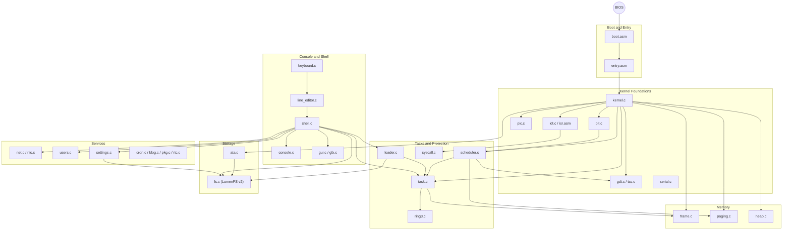

<div align="center">

[](https://github.com/ria0304/lumen)


# Lumen

**A 32-bit x86 operating system, built from a raw boot sector up.**

Lumen is written in C and assembly: a custom BIOS boot sector and a freestanding C kernel
(about 13,000 lines of C). It is developed and tested under QEMU only. It has paging with per-task
address spaces, a bitmap frame allocator, an interrupt-safe free-list heap, preemptive multitasking
across Ring 0 and Ring 3, a 25-number syscall table, an ATA disk driver, a persistent filesystem
(LumenFS v2), an ELF loader, a text-mode GUI, and a basic RTL8139 network stack.

</div>

---

## Status

**Active development, well past bring-up.** The system boots a raw floppy image, enters protected
mode, and hands off to a C kernel that initializes the GDT/TSS, IDT, paging, frame allocator, PIC,
PIT, keyboard, scheduler, heap, ATA, LumenFS, and the higher-level subsystems below, running a
self-test for each one and printing `SELFTEST <name> PASS/FAIL` as it goes. It then drops into an
interactive shell.

`make test` boots a headless build, captures the serial log, and fails the build if any self-test
reports FAIL. See [Testing](#testing) and [Known Limitations](#known-limitations).

The suite drives real work rather than just initialisation: a CPL 3 task does
file I/O through the syscall table and the kernel re-reads what it wrote, two
Ring 3 programs fault deliberately and must be retired without taking the
machine down, and `fork()` is checked for real address-space isolation (the
child overwrites an inherited page; the parent's copy must be untouched),
`exec()` replaces a Ring 3 image with a program read from LumenFS whose
output the kernel then verifies, an ELF executable built by a real toolchain is
loaded through the ELF header path (finding two bugs in it),, and a dedicated probe drives the syscall
dispatcher's error paths -- bad signal numbers, out-of-range descriptors and
pids, kernel pointers passed as signal handlers, and unimplemented syscall
numbers.

---

## Table of Contents

- [Current State](#current-state)
- [Boot Sequence](#boot-sequence)
- [Architecture](#architecture)
- [Memory Layout](#memory-layout)
- [Storage](#storage)
- [Design Decisions](#design-decisions)
- [Known Limitations](#known-limitations)
- [Building and Running](#building-and-running)
- [Testing](#testing)
- [Repository Layout](#repository-layout)
- [Roadmap](#roadmap)
- [License](#license)

---

## Current State

| Component | Status | Notes |
|---|---|---|
| Boot sector | Implemented | Loads the kernel with BIOS extended reads (`int 0x13`, AH=`0x42`, LBA), enables A20, loads a GDT, switches to protected mode. The sector count is **derived from the built kernel size** by the Makefile, not hand-maintained |
| Kernel entry | Implemented | `entry.asm` sets the stack, **zeroes `.bss`**, then calls `kmain()` |
| GDT / TSS | Implemented | Flat kernel segments, Ring 3 segments, and a TSS whose `esp0` is repointed per task by the scheduler |
| IDT / exceptions | Implemented | All 32 exception vectors, 16 IRQ vectors, and a DPL-3 gate at `int 0x80`. Page faults print `CR2` |
| PIC | Implemented | IRQs remapped to vectors 32-47, explicit masking, **spurious IRQ7/IRQ15 detection** (`pic_is_spurious()`) |
| PIT | Implemented | 100 Hz; drives the scheduler and the uptime clock |
| Keyboard | Implemented | Shift, **Caps Lock**, and `0xE0`-prefixed extended scancodes |
| Serial (COM1) | Implemented | Mirrors boot output; `make test` reads results from it |
| Paging | Implemented | Master kernel directory plus a separate page directory per Ring 3 task, switched on every context switch |
| Frame allocator | Implemented | Bitmap over the first 16 MiB (`FRAME_MEMORY_LIMIT`) |
| Kernel heap | Implemented | Free-list `kmalloc`/`kfree` with splitting and coalescing, guarded by interrupt-disabling critical sections (`lock.h`) |
| Tasks / scheduler | Implemented | Up to `MAX_TASKS` (16), Ring 0 and Ring 3, round-robin, PIT-driven. `fork`, `wait`, block/wake, exit/terminate |
| Fault isolation | Implemented | A recoverable Ring 3 fault kills that task, not the machine. A Ring 0 fault halts |
| Syscalls | Implemented (partial) | 25 numbers defined in `syscall.h` (`SYS_GETPID` .. `SYS_RECV`) and dispatched in a `switch`. Some are thin: `SYS_SOCKET` returns a fixed loopback fd |
| ATA driver | Implemented | PIO reads/writes, used by LumenFS. DMA is compiled out by default -- see limitations |
| LumenFS v2 | Implemented | 1 KiB blocks, inodes, directories, direct + indirect blocks, symlinks, hard links, Unix-style permissions and `chmod`/`chown`. v1 images are rejected at mount. See [Storage](#storage) |
| ELF loader | Implemented | `loader.c` starts a flat binary or an ELF executable from LumenFS as a Ring 3 task. Both paths are covered end to end (RING3EXE, RING3ELF); the ELF test stages a real toolchain-produced ELF |
| Shell | Implemented | Line editor plus commands for tasks, storage, users, settings, networking, and demos. `help` output lags the real command set |
| Users | Implemented | `users.c`; `sudo`, `useradd`, `login` |
| Settings | Implemented | `settings.c`; persisted to LumenFS |
| RTC | Implemented | Wall-clock time; `date` |
| Network | Non-functional on real NIC | Loopback send/recv works. The RTL8139 driver finds and initialises the device but neither transmits nor receives; ARP and ICMP are coded and unit-tested only. See limitations |
| GUI | Implemented (minimal) | Text-mode desktop (`gui.c`, `gfx.c`) |
| Cron / klog | Implemented (basic) | `cron.c` job table, `klog.c` kernel log ring |
| `pkg` | Stub | In-memory table of up to 16 name/version pairs. Nothing is downloaded, unpacked, or persisted |

---

## Boot Sequence

1. The BIOS loads the boot sector (`boot/boot.asm`) to `0x7C00`.
2. The boot sector reads the kernel from LBA 1 onward to `0x10000`, one sector at a time via
   `int 0x13` extended read. The number of sectors comes from the Makefile, which computes it from
   the real `kernel.bin` size plus one slack sector.
3. It enables A20 (port `0x92`), loads the GDT, and sets `CR0.PE`.
4. A far jump into 32-bit code reloads the segment registers; the stack pointer is set to `0x90000`.
5. `kernel/entry.asm` zeroes `.bss` and calls `kmain()`.
6. `kmain()` initializes, in order: serial, IDT, TSS/GDT, frame allocator, paging, PIC, PIT,
   keyboard, line editor, shell, tasks, scheduler, heap, ATA, filesystem, and then RTC, GUI,
   settings, users, network, `pkg`, `/proc`-style info, klog, cron, gfx, and NIC. Most steps run a
   self-test and print its result. It then executes `sti` and idles in the shell.

Real-mode progress is printed through BIOS teletype: `READ_OK`, `A20_OK`, `GDT_OK`, `PM_START`.
A failed read prints `DISK_ERROR` and halts.

---

## Architecture



---

## Memory Layout

| Address | Purpose |
|---|---|
| `0x00007C00` | Boot sector; initial real-mode stack top |
| `0x00010000` | Kernel image (load and link address) |
| `0x00090000` | Protected-mode stack top |
| `0x000B8000` | VGA text buffer, 80x25 cells |
| `0x00220000` | Master kernel page directory |
| `0x00221000` | Master kernel first page table |
| `0x00400000` | Kernel heap start; also the identity-mapping boundary (`PAGING_IDENTITY_LIMIT`) |
| `0x00C00000` / `0x00C01000` | Legacy single-instance Ring 3 code / stack (`usermode` command) |
| `0x01000000` / `0x01001000` | Per-task Ring 3 code / stack base (`taskuser`) |
| `0x00000000`-`0x00FFFFFF` | Range tracked by the frame allocator (`FRAME_MEMORY_LIMIT`, 16 MiB) |

---

## Storage

Lumen uses two disks under QEMU:

- **Floppy image** (`build/lumen.img`, 1.44 MiB): boot sector plus kernel. Rebuilt by `make`.
- **IDE disk** (`build/disk.img`, 4 MiB): LumenFS v2. Created once and **left alone by rebuilds**, so
  files survive reboots. Run `make disk-reset` to wipe it.

LumenFS v2 (`kernel/fs_format.h`): magic `LUMFS2`, 1 KiB blocks, 10 direct block pointers plus one
indirect block per inode, a block bitmap cached in kernel memory, directories, symlinks, hard links,
and permission checks against a credential (`uid`/`gid`). The shell runs as root; a `nobody`
identity exists so the permission checks can be tested.

---

## Design Decisions

- **Custom bootloader instead of GRUB.** The project covers the path from power-on to a running kernel.
- **Boot sector size is derived, not guessed.** The Makefile measures `kernel.bin`, passes
  `-DKERNEL_SECTORS` to NASM, and fails the build with a clear error if the kernel exceeds
  `BOOT_MAX_SECTORS` (384 sectors, 192 KiB). Truncation can no longer happen silently.
- **Flat GDT plus Ring 3 and TSS descriptors.** Protection comes from paging and privilege levels,
  not segment limits.
- **PIC lines masked by default.** Add the ISR stub and IDT gate first, unmask second.
- **One page directory per Ring 3 task.** The scheduler swaps `CR3` on every context switch.
  Kernel-ring tasks share the master directory, by design.
- **Interrupt-disabling locks.** Lumen is single-processor, so `irq_save_disable()` /
  `irq_restore()` (`lock.h`) is a complete mutual-exclusion primitive. Flags are saved and restored,
  not blindly re-enabled.
- **Round-robin scheduling with no priorities.**
- **Fault-driven task teardown.** A Ring 3 fault on a conservative set of vectors terminates that
  task only.
- **Persistent second disk.** Filesystem data lives on its own image so kernel rebuilds do not
  destroy it.

---

## Known Limitations

- **Frame allocator is capped at 16 MiB.** `FRAME_MEMORY_LIMIT` is a compile-time constant and there
  is no BIOS memory-map probing (`int 0x15, eax=0xE820`). `MAX_TASKS` is a fixed 16.
- **Boot still depends on BIOS.** No UEFI, and it is only exercised under QEMU. It has not been
  tested on physical hardware.
- **Boot sector ceiling is 384 sectors (192 KiB).** The build fails loudly past that, but it is a
  hard limit until the loader reads a size header or uses a second stage.
- **Locking is limited to a few subsystems.** The heap and filesystem use interrupt-disabling
  locks; other shared state (for example the task table) is not audited for preemption safety.
- **`pkg` is a stub.** It records names and versions in a 16-entry in-memory table.
- **Some syscalls are placeholders.** For example `SYS_SOCKET` returns a fixed loopback fd. Treat the
  table as an in-kernel ABI under construction, not a stable interface.
- **Naming: "Lumen" everywhere.** The boot banner, shell prompt, `about`/`version` output,
  `make run` message, and image filename (`build/lumen.img`) all use one name and one version
  string from `kernel/version.h`.
- **`help` lags the shell.** It lists only a subset of the commands the shell accepts.
- **The RTL8139 driver does not work end to end.** The device is found,
  initialised and addressed correctly, and the ARP/ICMP code builds
  well-formed frames, but no frame reaches the wire and none is ever
  received, so `ping` gets no reply. `make test` attaches the NIC on
  QEMU's user-mode network and drives a real ARP and ICMP exchange, so
  this is reported on every run rather than passing silently; the test
  skips (does not fail) when no peer answers.

  Bugs found and fixed while diagnosing it:

  - the 8 KiB receive ring was backed by a single 4 KiB frame, so the
    ring ran past its own allocation;
  - ARP frames were sent 42 bytes long, below the 60-byte Ethernet
    minimum, so they were dropped before reaching the peer;
  - register 0x10 (TxDescriptorStart) was being written with a frame
    length; it is the physical base of the descriptor array, so a
    length there told the device its descriptors lived at physical
    address 60;
  - the transmit was never kicked via the Tx Command register (0x50).

  What is still unexplained, from a host-side frame capture: with the
  descriptor ring correctly built and filled, TxDescriptorStart set,
  TSAD set, TxCommand written and the interrupt mask unmasked, every
  register reads back correctly -- and the transmit still never
  completes (no TOK) and nothing appears on the wire. The receive ring
  is likewise never populated. Ruled out along the way: the descriptor
  OWNER bit, toggling TxEnable to force a fresh edge, and the
  start/command ordering. The remaining work is to drive this device
  model correctly.
- **`SYS_WAIT` does not block.** It reaps an already-exited child and
  returns -1 otherwise, so a program that forks must keep yielding and
  retrying until the timer actually switches to the child.
- **The shell is keyboard-only.** It reads the PS/2 keyboard, not COM1, so piping commands into a
  headless QEMU session does not reach the prompt. `make test` drives the kernel through its
  self-tests instead.
- **ATA DMA is disabled by default (`LUMEN_ATA_USE_DMA=0`).** DMA reads do not reliably match
  programmed I/O: with DMA on, the superblock comes back as zeros, the filesystem cannot mount,
  and the controller is left such that later PIO reads return the same wrong bytes. Its spin-wait
  now reports failure so the PIO fallback engages, and the missing PCI Bus Master Enable is set, so
  Two real defects were found and fixed along the way:

  - the bus master IDE registers were placed at `0xD000`, which is a
    memory address, not an I/O port. They belong at `0xC0` (primary
    channel) / `0xD0` (secondary). Every write went to an unmapped port,
    so the engine never ran, while reads returned `0xFF` -- and `0xFF`
    has the interrupt bit set, so the completion loop reported instant
    success on every transfer without moving a byte. The drive was left
    mid-command, which is why even later programmed reads returned
    nothing;
  - the completion loop tested the interrupt bit *before* the error bit.
    A failed transfer sets both, so every failure was reported as a
    success.

  What remains: with the ports corrected, the bus master now responds
  and reports a transfer error, so the error is visible and the
  filesystem falls back to PIO rather than being fed garbage -- but DMA
  still does not complete. Programmed I/O is correct in every
  configuration. The self-test compares DMA against PIO directly and
  fails with the offending address and offset, so enabling DMA is a red
  build rather than a silent one. PIO is slower and correct.
- **Build warnings.** Expected and non-fatal: executable-stack and RWX-segment linker warnings from
  `tss_load.o`, plus assorted `-Wmisleading-indentation` and unused-parameter warnings in
  `shell.c`, `ata.c` and `task.c`.

---

## Building and Running

### Requirements

- GCC with 32-bit support (`gcc-multilib` on Debian/Ubuntu)
- GNU binutils
- NASM
- QEMU (`qemu-system-x86`)
- GDB (optional)

```bash
sudo apt install build-essential gcc-multilib nasm qemu-system-x86 gdb
```

### Build

```bash
make
```

Produces `build/lumen.img` (boot sector + kernel, padded to 1.44 MiB) and, if missing,
`build/disk.img` (blank 4 MiB LumenFS disk). The build prints the kernel size and the sector count
it chose, for example `kernel 138416 bytes -> 272 sectors`. `make clean` removes `build/` and
`build-test/`; `make disk-reset` recreates the data disk.

### Run

```bash
make run
```

This boots QEMU with a curses display (quit with `Ctrl-A X`), the floppy image as boot drive, the
IDE disk as the data drive, and serial on stdio. Extra QEMU flags can be passed via `QEMUFLAGS`.

---

## Testing

```bash
make test
```

Builds a separate `build-test/` copy with `-DLUMEN_AUTOEXIT`, boots it headless on a **fresh**
disk, captures the serial log to `build-test/boot.log`, and exits QEMU on its own after the
self-tests. It prints every `SELFTEST` line and passes only if a `SELFTEST-SUMMARY` line appears and
no self-test failed.

Self-tests cover: GDT, TSS, IDT, FRAME, PAGING, TASK, SCHEDULER, ATA, RTC, FS, HEAP, GUI, SETTINGS,
USERS, NET, PKG, PROC, KLOG, CRON, GFX, and NIC. ATA and FS report `SKIP` if no drive or no
formatted filesystem is present.

---

## Repository Layout

```
Lumen/
├── boot/
│   ├── boot.asm         Boot sector: LBA kernel load, A20, GDT, protected-mode switch
│   └── boot_day1.asm    Early 16-bit prototype; not part of the build
├── kernel/
│   ├── entry.asm        32-bit entry: stack, .bss zeroing, calls kmain()
│   ├── kernel.c         kmain(), exception dispatch, boot self-test sequencing
│   ├── console.c        VGA terminal
│   ├── serial.c         COM1 output
│   ├── gdt.c, tss.c     Descriptors, TSS (+ gdt_flush.asm, tss_load.asm)
│   ├── idt.c, isr.asm   IDT, ISR/IRQ/syscall stubs
│   ├── pic.c, pit.c     PIC (with spurious-IRQ handling), timer
│   ├── keyboard.c       Scancodes, Shift, Caps Lock, extended keys
│   ├── line_editor.c    Line buffering for the shell
│   ├── shell.c          Command parser and commands
│   ├── paging.c         Master directory, per-task address spaces
│   ├── frame.c          Bitmap frame allocator (16 MiB)
│   ├── heap.c, kmem.c   Free-list heap, kernel memory helpers
│   ├── lock.h           Interrupt-disabling critical sections
│   ├── task.c           Task table, create/fork/wait/terminate
│   ├── scheduler.c      Round-robin, PIT-driven
│   ├── ring3.c          Ring 3 program mapping + entry (+ usermode.asm)
│   ├── syscall.c/.h     int 0x80 dispatch (25 syscall numbers)
│   ├── ata.c            ATA PIO/DMA driver
│   ├── fs.c, fs.h       LumenFS v2 driver and API
│   ├── fs_format.h      On-disk format
│   ├── loader.c, elf.h  Flat-binary and ELF loader
│   ├── rtc.c            Real-time clock
│   ├── settings.c       Persistent settings
│   ├── users.c          Users and credentials
│   ├── net.c, nic.c     Network stack, RTL8139 driver
│   ├── gui.c, gfx.c     Text-mode desktop
│   ├── cron.c, klog.c   Job table, kernel log
│   ├── pkg.c, proc.c    In-memory pkg table, system info
│   └── task_demo.c      Trivial task entry used by task_create()
├── linker.ld            Kernel linked at 0x10000; exports __bss_start/__bss_end
├── Makefile             build, run, test, disk-reset, clean
└── run.sh               Empty; use `make run`
```

---

## Roadmap

1. **Boot and kernel foundation** (done)
2. **Interrupts and input** (done): full IDT, PIC with spurious-IRQ handling, PIT, keyboard with Caps
   Lock and extended scancodes.
3. **Memory management** (done for the core): paging with per-task address spaces, frame allocator,
   interrupt-safe heap. Remaining: probe the real memory map instead of a fixed 16 MiB.
4. **Processes and shell** (done for the core): preemptive scheduling, fault isolation, syscall table,
   `fork`/`wait`/`exec`. Remaining: priorities, locking audit beyond heap/fs, raising `MAX_TASKS`
   if it matters.
5. **Storage and filesystem** (done): ATA PIO/DMA and LumenFS v2.
6. **Utilities and stabilization** (done for the core): program loading from LumenFS (flat + ELF),
   users, settings, cron, klog, `make test` harness. Remaining: real `pkg`, unify naming, complete
   `help`.
7. **Networking and graphics** (basic): RTL8139, ARP, ICMP, text-mode GUI. Remaining: TCP/UDP,
   sockets that go beyond the loopback stub, VESA framebuffer, mouse.

The project is developed part-time with a target of April 2027. Milestones 1 through 5 count as a
successful outcome; milestone 7 is optional.

---

## License

MIT.
